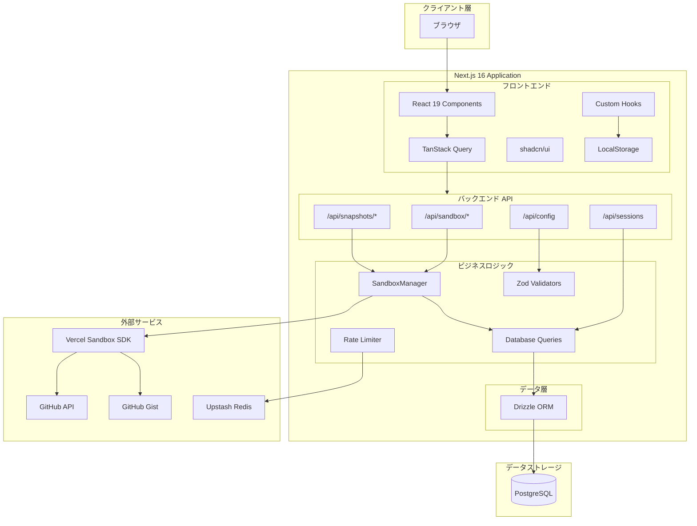
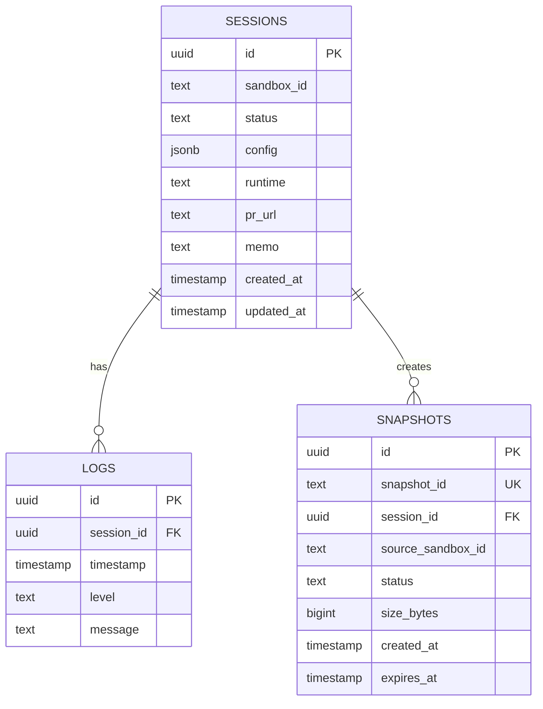
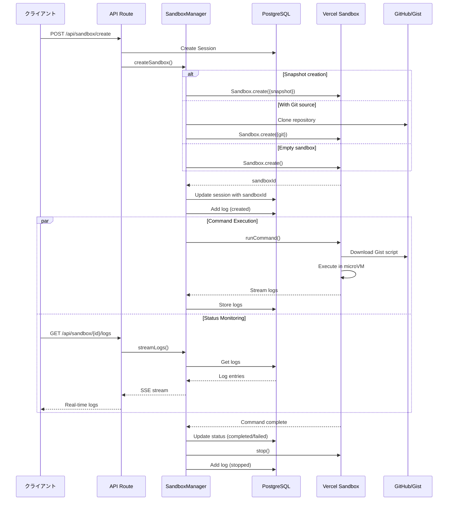
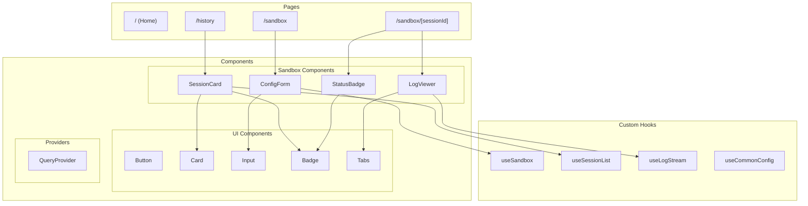
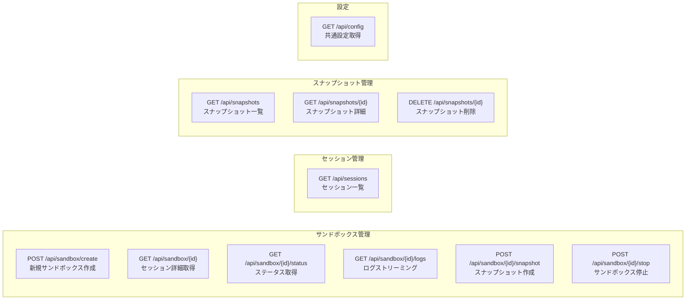
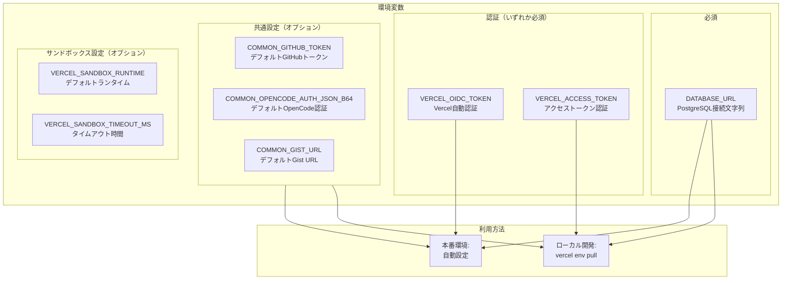

# システム構成図

## 全体アーキテクチャ

## データベーススキーマ

## サンドボックスライフサイクル

## コンポーネント構成

## API エンドポイント

## 環境変数と認証

## 技術スタック

| レイヤー | 技術 | 用途 |
|---------|------|------|
| フレームワーク | Next.js 16 | App Router, API Routes |
| 言語 | TypeScript 5 | 型安全性 |
| フロントエンド | React 19 | UIフレームワーク |
| UIライブラリ | shadcn/ui + Tailwind CSS 4 | コンポーネント, スタイリング |
| 状態管理 | TanStack Query | サーバーステート管理 |
| データベース | PostgreSQL | データ永続化 |
| ORM | Drizzle ORM | データベース操作 |
| サンドボックス | @vercel/sandbox | Linux microVM管理 |
| 認証 | Vercel OIDC Token | セキュア認証 |
| バリデーション | Zod | データ検証 |
| レート制限 | Upstash Redis | API保護 |
